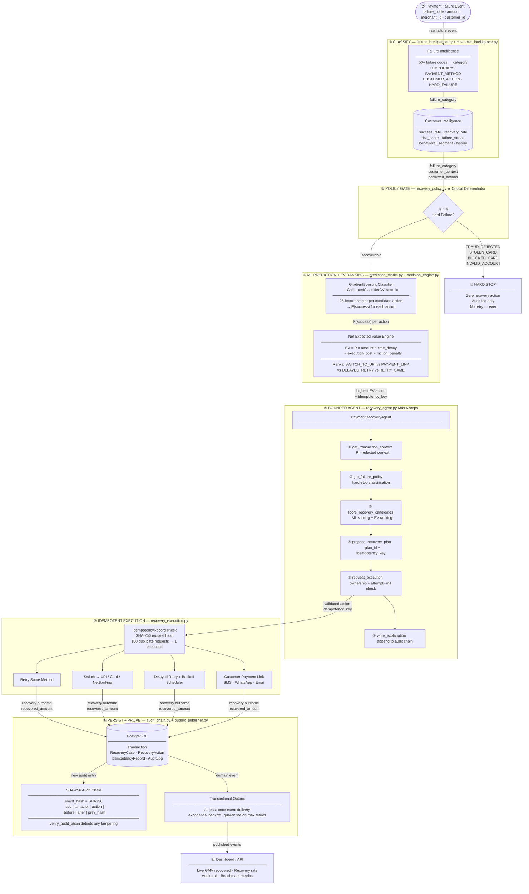
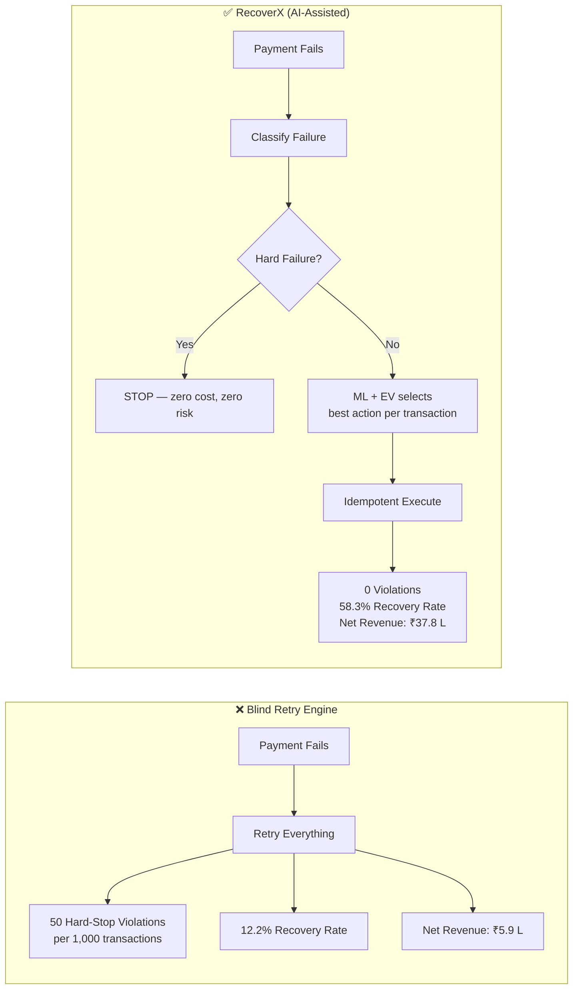
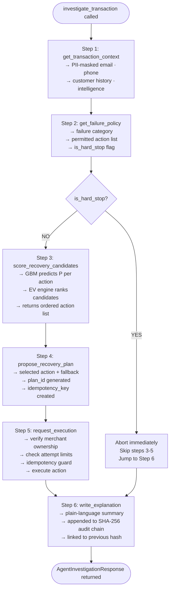
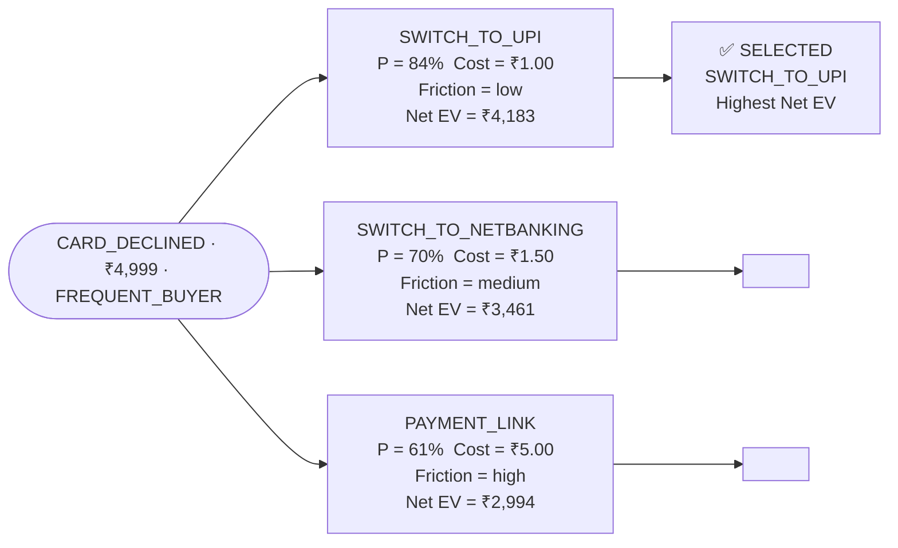

<div align="center">

# RecoverX

### AI-Powered Payment Recovery Agent

**Razorpay AI Buildathon 2026 — Track 03: AI Revenue Recovery**


</div>

---

## What is RecoverX?

RecoverX is a **Bounded AI-Assisted Payment Recovery Agent** that detects failed payments, predicts per-action recovery probabilities using calibrated machine learning, selects the optimal intervention via Net Expected Value optimization, enforces deterministic safety policy guardrails, executes bounded recovery workflows, and measures actual revenue recovered.

> **Zero Generative LLM in Core Financial Path**: Recovery decisions are driven by calibrated ML (`GradientBoosting` + isotonic regression) and Net Expected Value math, bound by strict deterministic policy gates. This prevents hallucinations, unbounded loops, or compliance violations on live financial transactions.

---

## Results

Benchmark evaluated on 1,000 transactions with a fixed seed — 100% reproducible and order-invariant.

| Strategy | Recovery Rate | Net Revenue Recovered | Policy Violations |
|---|---|---|---|
| No Action | 0.0% | ₹0 | 0 |
| Blind Immediate Retry | 12.2% | ₹5,93,785 | **50** |
| Rule-Based Heuristic | 59.0% | ₹37,30,049 | 0 |
| **RecoverX (Cost-Aware EV Agent)** | **58.3%** | **₹37,77,203** | **0** |

- **+₹31,83,418** net revenue vs blind retry (+536%)
- **+₹47,153** net revenue vs rule heuristic (cost-awareness advantage)
- **Zero** hard-stop policy violations — fraud and terminal failures are never retried

```bash
python -m benchmark.run_benchmark --seed 42 --transactions 1000
```

---

## Architecture

### Full System Pipeline

> Every box is a real module. Every arrow is a real data contract. The **Policy Gate** and **EV Optimizer** are what separate RecoverX from a simple retry engine.



---

### Why RecoverX Beats a Retry Engine



---

### Agent Internals — 6-Step Bounded Execution



---

### Decision Engine — Net Expected Value

RecoverX does not pick the highest-probability action. It picks the highest **Net Expected Value** action:

```
Net EV(action) = P(success) × amount × time_decay − execution_cost − friction_penalty

  time_decay    = e^(−0.01 × hours_to_recovery)
  friction_cost = 0.02 × amount × friction_score
```

**Live example — ₹4,999 card decline, FREQUENT_BUYER customer:**



---

## Benchmark Integrity & Fairness

The benchmark framework enforces strict mathematical fairness and causal integrity:

1. **Separation of Hidden Ground Truth & Observable Facts**: The agent and baseline strategies only receive `ObservableFailureEvent` (failure code, category, amount, customer history). They have zero access to `HiddenGroundTruth` (customer willingness, liquid balance, terminal fraud flags).
2. **Strategy-Fair Deterministic Outcomes**: For any `(seed, scenario_id, action)`, stochastic outcomes are deterministically derived using SHA-256 seed hashing.
3. **Execution-Order Invariance**: Strategy execution order cannot affect benchmark results. Running RecoverX before or after Blind Retry yields bit-for-bit identical results.
4. **Reproducibility**: No non-deterministic `uuid4()` calls or unseeded RNGs exist in the benchmark pipeline. Running `--seed 42` produces identical numbers every time.

---

## Project Structure

```
├── backend/app/
│   ├── api/                  # FastAPI REST endpoints
│   ├── models/               # SQLAlchemy ORM (Transaction, AuditLog, IdempotencyRecord, ...)
│   ├── schemas/              # Pydantic request/response models
│   └── services/
│       ├── failure_intelligence.py   # Failure taxonomy + classification
│       ├── customer_intelligence.py  # Customer history + risk scoring
│       ├── recovery_policy.py        # Deterministic policy gate
│       ├── prediction_model.py       # GBM + isotonic ML model
│       ├── decision_engine.py        # Net EV calculator + action ranker
│       ├── recovery_agent.py         # Bounded 6-step orchestrator
│       ├── recovery_execution.py     # Idempotent execution engine
│       ├── audit_chain.py            # SHA-256 tamper-evident ledger
│       └── outbox_publisher.py       # At-least-once event delivery
├── benchmark/
│   ├── scenarios.py          # Causal separation: HiddenGroundTruth vs ObservableFailureEvent
│   ├── simulator.py          # Payment environment (physics-based outcome resolution)
│   ├── baselines.py          # No Action, Blind Retry, Rule Heuristic, RecoverX
│   ├── metrics.py            # StrategyMetrics: recovery rate, GMV, cost, violations
│   └── run_benchmark.py      # 4-way comparative benchmark CLI
├── tests/
│   ├── evaluation/           # Benchmark invariants: seed determinism, zero hard-stop violations
│   ├── invariants/           # Double-recovery guard, audit chain integrity
│   └── security/             # PII masking, tenant isolation, auth
├── scripts/
│   ├── evaluator_check.py    # 20-point automated compliance audit
│   └── demo_end_to_end.py    # 5-scenario interactive walkthrough
├── docs/                     # Architecture docs, security disclosure
├── Dockerfile
├── docker-compose.yml
└── .github/workflows/ci.yml
```

---

## Getting Started

### Prerequisites

- Python 3.12+
- Docker Desktop (for full stack)

### Run without Docker (benchmark + tests only)

```bash
git clone https://github.com/shiva-kumar-1319/RazorPay-Hackathon
cd RazorPay-Hackathon
python -m venv .venv

# Windows
.venv\Scripts\activate
# macOS / Linux
source .venv/bin/activate

pip install -r requirements.txt

# Run automated compliance audit
python scripts/evaluator_check.py

# Run benchmark
python -m benchmark.run_benchmark --seed 42 --transactions 1000

# Run test suite
pytest tests/ -q
```

### Run full stack with Docker

```bash
docker-compose up --build
```

| Endpoint | URL |
|---|---|
| Dashboard | http://localhost:8000/dashboard |
| API Docs (Swagger) | http://localhost:8000/docs |
| Health | http://localhost:8000/health |

### Interactive Demo (5 scenarios)

```bash
python scripts/demo_end_to_end.py
```

Runs five payment failure scenarios end-to-end — classification, ML scoring, EV decision, execution, and audit chain verification:

| # | Failure | Recovery Action |
|---|---|---|
| 1 | CARD_DECLINED (₹4,999) | SWITCH_TO_UPI → recovered |
| 2 | FRAUD_REJECTED (₹28,500) | HARD STOP → zero action, audit logged |
| 3 | TIMEOUT (₹1,250) | DELAYED_RETRY → scheduled |
| 4 | INSUFFICIENT_FUNDS (₹8,000) | PAYMENT_LINK → customer pays via link |
| 5 | UPI_FAILURE (₹3,100) | DELAYED_RETRY → recovered |

---

## Verification

```bash
# Compliance audit — must exit 0
python scripts/evaluator_check.py

# Expected output:
# AUDIT SUMMARY: CRITICAL: 0 | HIGH: 0 | WARNINGS: 0
# ALL EVALUATION CHECKS PASSED SUCCESSFULLY.
```

```bash
# Test suite
pytest tests/ -q

# Expected output:
# 180 passed, 3 warnings in 19.10s
```

---

## Tech Stack

| Layer | Technology |
|---|---|
| API | FastAPI + Uvicorn |
| Database | PostgreSQL + SQLAlchemy (async) |
| Cache / Events | Redis |
| ML | scikit-learn (GradientBoosting + isotonic calibration) |
| Migrations | Alembic |
| Testing | pytest + pytest-asyncio |
| Containerization | Docker + Docker Compose |
| CI | GitHub Actions |

---

## Scope and Design Decisions

- **Simulated execution**: Recovery actions execute against `PaymentEnvironmentSimulator`. No real payment gateway is connected.
- **Synthetic ML training data**: The model is trained on domain-knowledge-derived synthetic labels. It has not been validated on live payment data.
- **Demo authentication**: API keys are hardcoded for evaluation. Production deployment requires a proper secrets manager and key rotation.
- **Prototype grade**: Not PCI-DSS certified or RBI-compliant. This demonstrates the architecture, decision logic, and measurement methodology.

---

*Razorpay AI Buildathon 2026 · Track 03: AI Revenue Recovery*
