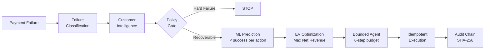

<div align="center">

# RecoverX

### AI-Powered Payment Recovery Agent

**Razorpay AI Buildathon 2026 — Track 03: AI Revenue Recovery**


</div>

---

## What is RecoverX?

RecoverX is an autonomous payment recovery agent that detects failed payments, determines the optimal recovery action using ML-predicted expected value, enforces policy safety guardrails, executes bounded recovery workflows, and measures the actual revenue recovered.

**It turns payment failures from a write-off into a recoverable revenue opportunity.**

---

## Results

Benchmark evaluated on 1,000 transactions with a fixed seed — fully reproducible.

| Strategy | Recovery Rate | Net Revenue Recovered | Policy Violations |
|---|---|---|---|
| No Action | 0.0% | ₹0 | 0 |
| Blind Immediate Retry | 11.3% | ₹5,71,877 | **50** |
| Rule-Based Heuristic | 59.3% | ₹37,34,346 | 0 |
| **RecoverX** | **59.3%** | **₹37,65,378** | **0** |

- **+₹31,93,501** net revenue vs blind retry (+559%)
- **+₹31,032** net revenue vs rule heuristic (cost-awareness advantage)
- **Zero** hard-stop policy violations — fraud and terminal failures are never retried

```bash
python -m benchmark.run_benchmark --seed 42 --transactions 1000
```

---

## How It Works

RecoverX processes each payment failure through a multi-stage pipeline:



### Decision Engine

RecoverX does not simply retry or pick the highest-probability action. It maximises **Net Expected Value**:

```
Net EV(action) = P(success) × amount × time_decay − execution_cost − friction_penalty
```

**Example — ₹4,999 card decline:**

| Action | P(Success) | Net EV | Selected |
|---|---|---|---|
| SWITCH_TO_UPI | 84% | ₹4,183 | ✅ |
| SWITCH_TO_NETBANKING | 70% | ₹3,461 | |
| PAYMENT_LINK | 61% | ₹2,994 | |

The UPI switch wins not just because it has the highest probability — it also has the lowest execution cost and lowest customer friction.

---

## Architecture

### System Layers

| Layer | Responsibility | Module |
|---|---|---|
| **Failure Intelligence** | Classifies 50+ failure codes into TEMPORARY / PAYMENT_METHOD / CUSTOMER_ACTION / HARD_FAILURE | `services/failure_intelligence.py` |
| **Customer Intelligence** | Computes success rate, recovery rate, risk score, behavioral segment from payment history | `services/customer_intelligence.py` |
| **Recovery Policy Gate** | Deterministic hard-stop enforcement — fraud and closed accounts are never retried | `services/recovery_policy.py` |
| **ML Prediction** | GradientBoostingClassifier + CalibratedClassifierCV (isotonic), 26-feature vector | `services/prediction_model.py` |
| **Decision Engine** | Ranks candidate actions by Net Expected Value, selects optimal within policy | `services/decision_engine.py` |
| **Bounded Agent** | Tool-calling orchestrator with 6-step execution budget and reasoning trace | `services/recovery_agent.py` |
| **Execution Engine** | Idempotent recovery actions: retry, payment method switch, delayed retry, customer payment link | `services/recovery_execution.py` |
| **Audit Chain** | Per-transaction SHA-256 linked audit log — tamper-evident, sequentially verifiable | `services/audit_chain.py` |
| **Outbox Publisher** | Transactional outbox with at-least-once delivery, exponential backoff, poison-event quarantine | `services/outbox_publisher.py` |

### Agent Design

The `PaymentRecoveryAgent` is a **deterministic bounded orchestrator** — not an LLM. No language model is in the recovery path. Financial execution requires deterministic policy guarantees.

The agent operates through exactly 6 registered tools:

| Step | Tool | Purpose |
|---|---|---|
| 1 | `get_transaction_context` | Load transaction + PII-redacted customer context |
| 2 | `get_failure_policy` | Evaluate hard-stop classification |
| 3 | `score_recovery_candidates` | ML prediction + EV ranking per action |
| 4 | `propose_recovery_plan` | Generate plan with idempotency key |
| 5 | `request_execution` | Execute with ownership and attempt-limit validation |
| 6 | `write_explanation` | Append to SHA-256 audit chain |

If Step 2 returns a hard failure, the agent terminates immediately — steps 3–5 are skipped.

### ML Model

| Property | Value |
|---|---|
| Algorithm | `GradientBoostingClassifier` (scikit-learn) |
| Calibration | `CalibratedClassifierCV` — isotonic regression |
| Features | 26-dimensional: transaction, customer history, failure category, action type, behavioral segment |
| Training | Synthetic domain-knowledge-derived labels (5,000 samples, 80/20 stratified split) |

### Safety Guarantees

- **Hard-stop policy**: `FRAUD_REJECTED`, `STOLEN_CARD`, `BLOCKED_CARD` → zero action, logged and stopped
- **Double-recovery prevention**: `REFUSED` if transaction status is already `SUCCEEDED`
- **Idempotency**: `IdempotencyRecord` with SHA-256 request hash — 100 identical requests → 1 execution
- **Attempt limits**: Configurable per failure category, enforced before every execution
- **`force_outcome` guard**: HTTP 403 if `APP_ENV` is not `test` — simulation fields cannot leak into production

### Audit Chain

Every action is appended to a per-transaction SHA-256 chain:

```
event_hash = SHA256(seq | timestamp | actor | action | before_state | after_state | details | prev_hash)
```

`verify_audit_chain()` recomputes the entire chain and detects any tampering, deletion, or reordering.

---

## Project Structure

```
├── backend/app/
│   ├── api/                  # FastAPI REST endpoints
│   ├── models/               # SQLAlchemy ORM (Transaction, AuditLog, IdempotencyRecord, ...)
│   ├── schemas/              # Pydantic request/response models
│   └── services/
│       ├── failure_intelligence.py   # Failure taxonomy + classification
│       ├── customer_intelligence.py  # Customer history + risk scoring
│       ├── recovery_policy.py        # Deterministic policy gate
│       ├── prediction_model.py       # GBM + isotonic ML model
│       ├── decision_engine.py        # Net EV calculator + action ranker
│       ├── recovery_agent.py         # Bounded 6-step orchestrator
│       ├── recovery_execution.py     # Idempotent execution engine
│       ├── audit_chain.py            # SHA-256 tamper-evident ledger
│       └── outbox_publisher.py       # At-least-once event delivery
├── benchmark/
│   ├── scenarios.py          # Causal separation: HiddenGroundTruth vs ObservableFailureEvent
│   ├── simulator.py          # Payment environment (physics-based outcome resolution)
│   ├── baselines.py          # No Action, Blind Retry, Rule Heuristic, RecoverX
│   ├── metrics.py            # StrategyMetrics: recovery rate, GMV, cost, violations
│   └── run_benchmark.py      # 4-way comparative benchmark CLI
├── tests/
│   ├── evaluation/           # Benchmark invariants: seed determinism, zero hard-stop violations
│   ├── invariants/           # Double-recovery guard, audit chain integrity
│   └── security/             # PII masking, tenant isolation, auth
├── scripts/
│   ├── evaluator_check.py    # 20-point automated compliance audit
│   └── demo_end_to_end.py    # 5-scenario interactive walkthrough
├── docs/                     # Architecture docs, security disclosure
├── Dockerfile
├── docker-compose.yml
└── .github/workflows/ci.yml
```

---

## Getting Started

### Prerequisites

- Python 3.12+
- Docker Desktop (for full stack)

### Run without Docker (benchmark + tests only)

```bash
git clone https://github.com/shiva-kumar-1319/RazorPay-Hackathon
cd RazorPay-Hackathon
python -m venv .venv

# Windows
.venv\Scripts\activate
# macOS / Linux
source .venv/bin/activate

pip install -r requirements.txt

# Run automated compliance audit
python scripts/evaluator_check.py

# Run benchmark
python -m benchmark.run_benchmark --seed 42 --transactions 1000

# Run test suite
pytest tests/ -q
```

### Run full stack with Docker

```bash
docker-compose up --build
```

| Endpoint | URL |
|---|---|
| Dashboard | http://localhost:8000/dashboard |
| API Docs (Swagger) | http://localhost:8000/docs |
| Health | http://localhost:8000/health |

### Interactive Demo (5 scenarios)

```bash
python scripts/demo_end_to_end.py
```

Runs five payment failure scenarios end-to-end — classification, ML scoring, EV decision, execution, and audit chain verification:

| # | Failure | Recovery Action |
|---|---|---|
| 1 | CARD_DECLINED (₹4,999) | SWITCH_TO_UPI → recovered |
| 2 | FRAUD_REJECTED (₹28,500) | HARD STOP → zero action, audit logged |
| 3 | TIMEOUT (₹1,250) | DELAYED_RETRY → scheduled |
| 4 | INSUFFICIENT_FUNDS (₹8,000) | PAYMENT_LINK → customer pays via link |
| 5 | UPI_FAILURE (₹3,100) | DELAYED_RETRY → recovered |

---

## Verification

```bash
# Compliance audit — must exit 0
python scripts/evaluator_check.py

# Expected output:
# AUDIT SUMMARY: CRITICAL: 0 | HIGH: 0 | WARNINGS: 0
# ALL EVALUATION CHECKS PASSED SUCCESSFULLY.
```

```bash
# Test suite
pytest tests/ -q

# Expected output:
# 180 passed, 3 warnings in 19.10s
```

---

## Tech Stack

| Layer | Technology |
|---|---|
| API | FastAPI + Uvicorn |
| Database | PostgreSQL + SQLAlchemy (async) |
| Cache / Events | Redis |
| ML | scikit-learn (GradientBoosting + isotonic calibration) |
| Migrations | Alembic |
| Testing | pytest + pytest-asyncio |
| Containerization | Docker + Docker Compose |
| CI | GitHub Actions |

---

## Scope and Design Decisions

- **Simulated execution**: Recovery actions execute against `PaymentEnvironmentSimulator`. No real payment gateway is connected.
- **Synthetic ML training data**: The model is trained on domain-knowledge-derived synthetic labels. It has not been validated on live payment data.
- **Demo authentication**: API keys are hardcoded for evaluation. Production deployment requires a proper secrets manager and key rotation.
- **Prototype grade**: Not PCI-DSS certified or RBI-compliant. This demonstrates the architecture, decision logic, and measurement methodology.

---

*Razorpay AI Buildathon 2026 · Track 03: AI Revenue Recovery*
