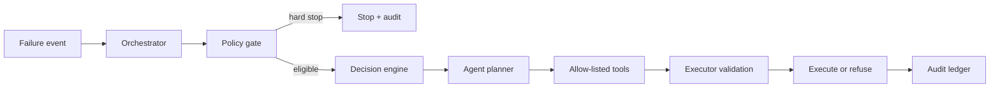

# Bounded Recovery Agent Architecture

The recovery agent is an orchestration and explanation layer, not a payment authority. Deterministic policy and the executor remain the only components allowed to permit and perform actions.

## Control flow

## Allowed tools

| Tool | Input | Effect |
| --- | --- | --- |
| `get_transaction_context` | transaction ID | Read-only facts and redacted history |
| `get_failure_policy` | failure category | Read-only permitted actions and stop rules |
| `score_candidates` | normalized candidate set | Read-only model scores and evidence |
| `create_recovery_plan` | chosen allowed action | Persists a draft with idempotency key |
| `request_execution` | approved plan ID | Sends a command to executor; executor revalidates |
| `write_explanation` | decision evidence | Adds structured audit explanation |

## Non-negotiable guardrails

- No free-form network, database-write, payment, or messaging tools.
- Tool inputs are schema-validated; transaction IDs and action types are never inferred from prose alone.
- The agent receives only tokenized/redacted customer context.
- A policy gate runs before planning and the executor repeats policy, status, amount, attempt, and expiry checks immediately before execution.
- Every tool invocation includes correlation ID, actor (`agent`), model/version, and result in the audit ledger.
- Agent output is advisory when confidence, evidence quality, or tool availability is below threshold.

## Failure behaviour

If any tool errors, returns stale data, or conflicts with policy, the case moves to `NEEDS_REVIEW` or `STOPPED`; it never falls back to an unconstrained retry. The customer-facing explanation uses deterministic reason codes, with optional agent-written language treated as presentation only.
