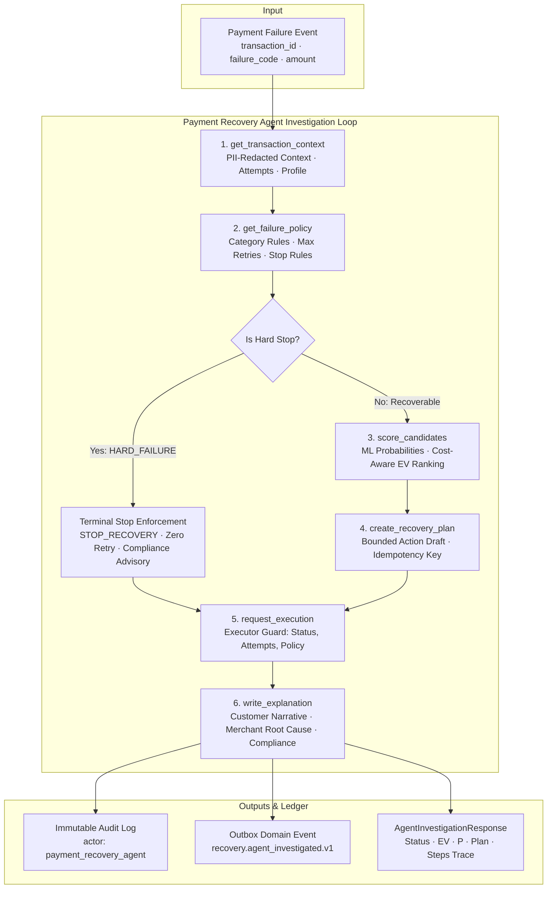

# Day 10 — Payment Recovery Agent

## Overview

Day 10 delivers the **Payment Recovery Agent** for RecoverX — a strictly bounded, tool-calling AI agent that investigates payment failure transactions, retrieves deterministic policy rules, scores candidate recovery actions using the Day 8 ML prediction model and Day 9 Expected Value decision engine, enforces pre-execution safety guards, and records explainable audit trails with tailored customer and merchant narratives.



---

## Allowed Tools & Tool Registry

The agent operates exclusively through **6 allow-listed, schema-validated tools** managed by `AgentToolRegistry`. Direct network requests, raw SQL execution, or arbitrary database writes are strictly disallowed.

| Tool Name | Category | Input Parameters | Safety Guardrail & Effect |
|---|---|---|---|
| `get_transaction_context` | `read_only` | `transaction_id` (str) | Fetches transaction facts and attempt history with **automatic PII masking** (email, phone, name tokenized). |
| `get_failure_policy` | `read_only` | `failure_code` (str) | Evaluates regulatory failure policy, canonical category, permitted candidate actions, max retry limits, and terminal stop rules. |
| `score_candidates` | `read_only` | `transaction_id`, `failure_code`?, `candidate_actions`? | Computes ML calibrated `P(success)` and net Expected Value (EV) with execution cost and customer friction penalties for policy-permitted actions. |
| `create_recovery_plan` | `planning` | `transaction_id`, `chosen_action`, `confidence_score`, `reason_codes`, `fallback_action`? | Formulates a validated recovery plan draft, enforces policy legality (rejects unpermitted actions), and generates unique idempotency keys. |
| `request_execution` | `execution_guard` | `transaction_id`, `recovery_plan_id`, `idempotency_key`? | **Pre-execution validation guard**: Revalidates transaction status (refuses if `SUCCEEDED`), attempt counts (blocks if max retries exceeded), and policy constraints. |
| `write_explanation` | `audit` | `transaction_id`, `recovery_plan_id`?, `explanation_summary`, `customer_message`, `merchant_notes`, `reason_codes` | Writes structured audit explanations to the immutable ledger linking actor `payment_recovery_agent`, reason codes, and compliance advisories. |

---

## Non-Negotiable Safety Guardrails

1. **No Free-Form Actions:** The agent cannot execute arbitrary SQL, invoke external webhooks, or trigger unconstrained financial transactions.
2. **Strict PII Redaction:** Customer emails (e.g. `p**********a@fintech.in`) and phone numbers (e.g. `+91 ******6789`) are masked before being presented to the agent.
3. **Deterministic Policy Gate Priority:** Hard failures (`FRAUD_REJECTED`, `EXPIRED_CARD`, `BLOCKED_CARD`, `INVALID_ACCOUNT`) immediately trigger terminal stop (`STOP_RECOVERY`) with 0 retries and PCI/AML compliance advisories.
4. **Executor Validation Guards:**
   - **Double-Billing Guard:** Refuses execution if transaction status is already `SUCCEEDED`.
   - **Attempt Ceiling Guard:** Blocks execution if prior attempts exceed `max_retries_permitted` for the category.
   - **Policy Revalidation:** Verifies selected action is within the category's permitted action set.
5. **Traceability & Auditability:** Every agent investigation records a step-by-step trace (`AgentStepTrace`) capturing thought, tool name, inputs, results, and duration in milliseconds.

---

## REST API Reference

| Method | Endpoint | Description |
|---|---|---|
| `GET` | `/api/v1/agent/tools` | Retrieve catalog of registered allow-listed tools, schemas, and guardrail constraints |
| `POST` | `/api/v1/agent/tools/execute` | Execute an individual allow-listed tool with strict schema validation |
| `POST` | `/api/v1/agent/investigate` | Run autonomous agent investigation on a failed transaction |
| `POST` | `/api/v1/agent/plan` | Create or validate a structured recovery plan |
| `GET` | `/api/v1/agent/traces/{transaction_id}` | Retrieve historical agent decision traces and audit explanations |

---

## Quickstart & Demonstration

### 1. Inspect Allow-Listed Agent Tools & Safety Guardrails
```bash
curl http://localhost:8000/api/v1/agent/tools
```

### 2. Run Autonomous Agent Investigation on a Failed Payment
```bash
curl -X POST http://localhost:8000/api/v1/agent/investigate \
  -H "Content-Type: application/json" \
  -d '{
    "transaction_id": "c2854e40-f191-4f1a-b7bc-e55325119d90"
  }'
```

**Example response (abridged):**
```json
{
  "investigation_id": "inv_8bd0b34473",
  "transaction_id": "c2854e40-f191-4f1a-b7bc-e55325119d90",
  "status": "COMPLETED",
  "failure_category": "PAYMENT_METHOD",
  "failure_code": "CARD_DECLINED",
  "chosen_action": "SWITCH_TO_UPI",
  "expected_value": 3412.50,
  "predicted_probability": 0.6850,
  "execution_disposition": "APPROVED",
  "customer_explanation": "Your card payment was declined by the issuing bank. Please complete payment using UPI or NetBanking.",
  "merchant_explanation": "Root cause: Issuer declined card transaction. Recommended SWITCH_TO_UPI via checkout_redirect.",
  "steps": [
    {
      "step_number": 1,
      "thought": "Investigate transaction failure facts, attempt history, and PII-redacted customer profile.",
      "tool_name": "get_transaction_context",
      "duration_ms": 1.45
    },
    {
      "step_number": 2,
      "thought": "Check deterministic failure policy and category boundaries for failure code 'CARD_DECLINED'.",
      "tool_name": "get_failure_policy",
      "duration_ms": 0.12
    },
    {
      "step_number": 3,
      "thought": "Score permitted recovery actions for PAYMENT_METHOD using ML success probabilities and net Expected Value optimization.",
      "tool_name": "score_candidates",
      "duration_ms": 3.80
    },
    {
      "step_number": 4,
      "thought": "Formulate structured recovery plan for optimal action 'SWITCH_TO_UPI' (EV: ₹3412.50, P: 68.5%).",
      "tool_name": "create_recovery_plan",
      "duration_ms": 4.10
    },
    {
      "step_number": 5,
      "thought": "Run pre-execution validation guards (status, attempt count, policy checks) to approve action execution.",
      "tool_name": "request_execution",
      "duration_ms": 2.20
    },
    {
      "step_number": 6,
      "thought": "Persist comprehensive audit explanation with customer and merchant narratives.",
      "tool_name": "write_explanation",
      "duration_ms": 2.05
    }
  ],
  "total_duration_ms": 14.12
}
```

### 3. Execute a Single Tool Interactively
```bash
curl -X POST http://localhost:8000/api/v1/agent/tools/execute \
  -H "Content-Type: application/json" \
  -d '{
    "tool_name": "get_failure_policy",
    "arguments": {
      "failure_code": "FRAUD_REJECTED"
    }
  }'
```

### 4. Fetch Agent Audit Traces for a Transaction
```bash
curl http://localhost:8000/api/v1/agent/traces/c2854e40-f191-4f1a-b7bc-e55325119d90
```

---

## Verification & Test Evidence

All **125 automated tests** pass with complete test coverage:
```bash
pytest -v
```
- **Allow-listed tools (9 tests):** PII masking, policy gate inspection, ML & EV scoring, plan creation with constraint enforcement, executor guards (double-billing and retry limit blocking), audit explanation recording, disallowed tool rejection.
- **Agent Autonomous Investigation (5 tests):** Multi-step investigation on `PAYMENT_METHOD`, `HARD_FAILURE` terminal stopping, `TEMPORARY` backoff scheduling, `CUSTOMER_ACTION` notification routing, safe fallback on missing transactions.
- **REST API Endpoints (9 tests):** Tool catalog discovery, tool execution endpoint, autonomous investigation endpoint, plan creation endpoint, policy violation validation, agent trace querying.
