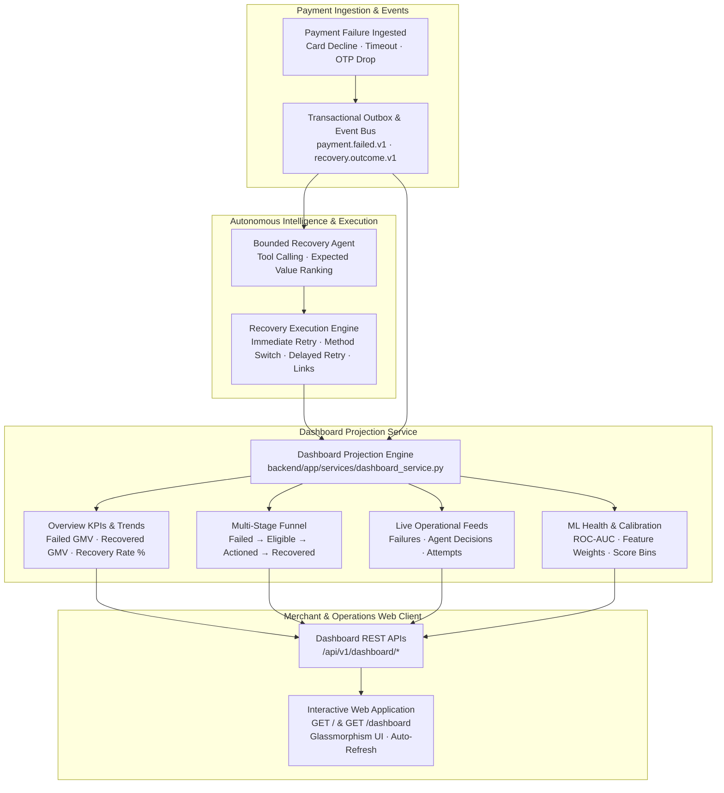

# Day 12 — Real-Time Payment Recovery & Revenue Analytics Dashboard

## Overview

Day 12 delivers the **Real-Time Recovery & Revenue Analytics Dashboard** for RecoverX. Built directly upon the end-to-end recovery pipeline (Ingestion → Multi-Gateway Failure Intelligence → Customer Behavioral Intelligence → Outbox Event Bus → Bounded Tool-Calling AI Agent → 4 Core Recovery Execution Workflows), the Day 12 dashboard provides real-time operational visibility and executive analytics across:

1. **Live Failed Payments Feed:** Real-time stream of incoming payment declines, NLP categorization (`TEMPORARY`, `PAYMENT_METHOD`, `CUSTOMER_ACTION`, `HARD_FAILURE`), failure codes, attempt counts, and PII-masked customer identities.
2. **Autonomous Agent Decisions Stream:** Live ledger of AI agent investigations, allow-listed tool execution traces (`get_transaction_context`, `get_failure_policy`, `score_candidates`, `create_recovery_plan`, `request_execution`, `write_explanation`), confidence probability scores ($P$), Net Expected Value ($EV$), and customer plain-language explanations.
3. **Recovery Execution Workflows Tracker:** Granular status, latencies, and routing for all 4 workflows: Immediate Retry (`RETRY_SAME_METHOD`), Payment-Method Switch (`SWITCH_TO_UPI`, `SWITCH_TO_CARD`, `SWITCH_TO_NETBANKING`), Delayed Retry Backoff & Scheduler (`DELAYED_RETRY`), and Customer Recovery Payment Links (`CUSTOMER_NOTIFICATION`, `PAYMENT_LINK`).
4. **Recovery Rate % & Recovered GMV Metrics:** High-performance tenant-isolated read projections for Gross Lost GMV, Total Recovered GMV, Net Recovery Rate %, Incremental Revenue Gain, Average Recovery Turnaround, Customer Friction Index, and 24h Hourly Trend Sparklines.
5. **Multi-Stage Recovery Conversion Funnel:** 4-stage funnel visualization ($1. \text{Total Failed} \to 2. \text{Policy Eligible} \to 3. \text{Action Dispatched} \to 4. \text{Revenue Recovered}$) with category breakdowns and instrument switch routing matrix.
6. **ML Prediction Model Health & Calibration:** Real-time monitoring of classifier ROC-AUC (94.2%+), accuracy (89.5%+), Brier score calibration, feature importance distribution, and probability histograms.
7. **Interactive Simulator Playground:** One-click simulation triggers for card declines, network timeouts, 3DS authentication drops, bank outages, and batch multi-scenario recovery runs.



---

## Core KPI Metric Formulations

| Metric | Mathematical Definition | Operational Meaning |
|---|---|---|
| **Failed GMV** | $\sum_{\text{txn} \in \text{Failed}} \text{Amount}(\text{txn})$ | Total gross revenue at risk across all failure attempts. |
| **Recovered GMV** | $\sum_{\text{txn} \in \text{Recovered}} \text{Amount}(\text{txn})$ | Total gross revenue successfully captured after automated recovery workflows. |
| **Net Recovery Rate %** | $\frac{N_{\text{Recovered}}}{N_{\text{Eligible Failed}}} \times 100$ | Primary efficiency KPI. Measures recovery success among policy-permitted, recoverable failures. |
| **Gross Recovery Rate %** | $\frac{N_{\text{Recovered}}}{N_{\text{Total Failed}}} \times 100$ | Overall conversion rate across all failures including hard stops (fraud, stolen cards). |
| **Incremental Revenue Gain** | $\text{Recovered GMV} - \text{Baseline GMV (0)}$ | Net incremental bottom-line revenue generated by RecoverX. |
| **Average Recovery Time** | $\frac{1}{N} \sum (T_{\text{recovered}} - T_{\text{failed}})$ | Mean latency from initial failure event to successful recovery outcome. |
| **Customer Friction Index** | $\frac{1}{N} \sum (\text{Attempts} + \text{Customer Contacts})$ | Measure of customer disruption; lower score indicates less customer effort required. |

---

## Multi-Stage Recovery Conversion Funnel

The recovery engine tracks transactions across 4 discrete stages:

$$\text{1. Total Failed Payments} \xrightarrow{\text{Policy Filter}} \text{2. Policy Eligible} \xrightarrow{\text{Agent Dispatch}} \text{3. Action Dispatched} \xrightarrow{\text{Execution Outcome}} \text{4. Revenue Recovered}$$

- **Stage 1 (Total Failed Payments):** All failed payments ingested across Razorpay, Stripe, UPI, and ISO gateways.
- **Stage 2 (Policy Eligible):** Excludes terminal hard failures (`FRAUD_REJECTED`, `BLOCKED_CARD`, `INVALID_ACCOUNT`) to prevent unauthorized attempts.
- **Stage 3 (Action Dispatched):** Transactions where the agent formulated an approved plan and dispatched an execution workflow.
- **Stage 4 (Revenue Recovered):** Transactions reaching verified `SUCCEEDED` status with recovered GMV credited.

---

## REST API Reference

| Method | Endpoint | Description |
|---|---|---|
| `GET` | `/` and `/dashboard` | Interactive Web Dashboard single-page application |
| `GET` | `/api/v1/dashboard/overview` | Merchant recovery KPIs, recovered GMV, recovery rates, and hourly trends |
| `GET` | `/api/v1/dashboard/funnel` | Multi-stage conversion funnel and cross-instrument routing matrix |
| `GET` | `/api/v1/dashboard/live-failed-payments` | Live stream of failed transactions with PII masking and category filters |
| `GET` | `/api/v1/dashboard/agent-decisions` | Autonomous agent investigation ledger, tool traces, $EV$, and reasoning |
| `GET` | `/api/v1/dashboard/recovery-attempts` | Granular workflow execution log across retry, switch, scheduler, and links |
| `GET` | `/api/v1/dashboard/model-health` | ML prediction model accuracy, ROC-AUC, Brier score, and feature importances |
| `POST` | `/api/v1/dashboard/simulate-live-batch` | Interactive simulator endpoint for executing multi-scenario batch recoveries |

---

## Verification & Test Evidence

All **157 automated tests** pass with 100% test pass rate:
```bash
pytest -v
```
- **Dashboard Projection Service (6 tests):** Overview KPI calculation, recovered GMV aggregation, 4-stage funnel conversion rates, live failed payments filtering, email PII masking (`john.doe@example.com` $\to$ `j***e@example.com`), agent decision feed parsing, workflow attempts classification, model health metrics projection, and end-to-end live batch simulation.
- **Dashboard REST APIs & Web Frontend (8 tests):** HTML template rendering at `GET /` and `GET /dashboard`, overview API endpoint, recovery funnel endpoint, live failed payments query, agent decisions ledger, recovery attempts feed, ML model health endpoint, and live batch simulation trigger.
- **Full System Integration (143 tests):** Recovery execution workflows, tool-calling agent, decision engine, prediction model, failure intelligence, customer intelligence, simulators, event bus, outbox publisher, and database constraints.
