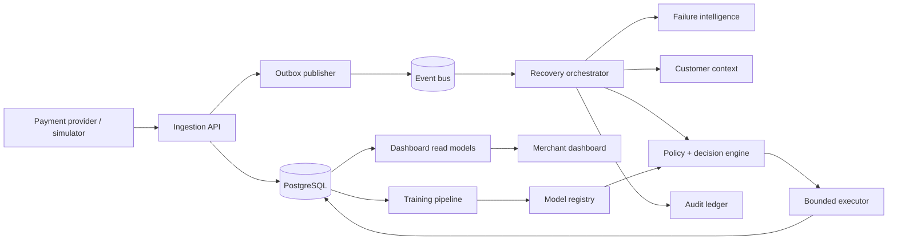

# Day 2 — System Architecture

This document is the implementation blueprint for RecoverX. It turns a failed-payment signal into a safe, measurable recovery workflow without letting an AI model directly trigger a payment action.

## Goals

- Recover eligible failed payments while respecting failure policy and customer friction.
- Keep every decision explainable, idempotent, and traceable.
- Separate real-time recovery decisions from asynchronous analytics and training.
- Support a simulator first; preserve interfaces for a payment-service-provider integration later.

## Architecture principles

1. **Events are facts.** Payment outcomes and recovery outcomes are immutable domain events.
2. **PostgreSQL is authoritative.** Redis, read models, and model features can be rebuilt.
3. **Policy precedes prediction.** A model can rank only actions already permitted by deterministic policy.
4. **Commands are idempotent.** A duplicate delivery cannot create a duplicate attempt or notification.
5. **The agent is tool-bounded.** It can explain and orchestrate only approved tools; the executor enforces final guards.

## Logical view

## Runtime paths

| Path | Latency target | Consistency |
| --- | --- | --- |
| Payment ingestion and acknowledgement | p95 under 300 ms | Transactional write |
| Recovery decision after failure event | p95 under 2 s | At-least-once event processing + idempotency |
| Dashboard operational detail | under 5 s behind source | Eventually consistent read model |
| Training and model evaluation | batch | Offline, reproducible |

## Day 2 decisions

- Begin with a Postgres outbox and Redis Streams consumer group; the event contract remains transport-neutral for Kafka migration.
- Use append-only event/audit rows plus mutable projections for the current recovery state.
- Store money as `NUMERIC(18,2)`, all timestamps in UTC, and use UUIDs internally.
- Treat payment instruments and PII as tokenized references; never put raw secrets or card data in events, logs, or model features.

The following Day 2 documents refine this design by concern: event flow, services, persistence, agent, ML, dashboard, interfaces, resilience, and delivery plan.
