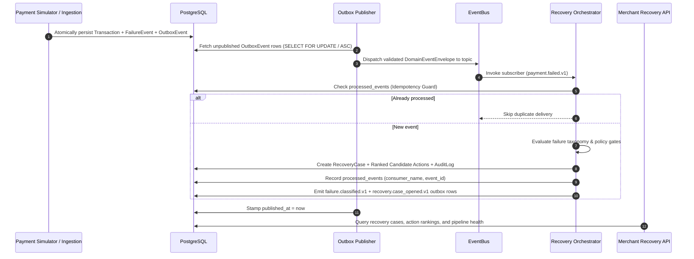

# Day 5 — Real-Time Event Pipeline & Recovery Service

## Overview

Day 5 implements the **Real-Time Event Pipeline & Recovery Orchestrator** for RecoverX, connecting upstream payment failure events generated by the payment ingestion layer and payment simulator to an asynchronous, reliable event pipeline and automated recovery orchestrator.

The pipeline adheres strictly to the **Transactional Outbox Pattern**, **At-Least-Once Delivery with Idempotent Consumer Guards**, **Poison-Event Dead-Letter Quarantine**, and **Deterministic Recovery Policy Action Generation**.



---

## Key Deliverables

### 1. In-Process & Async Event Bus (`backend/app/services/event_bus.py`)
- Topic-based publish/subscribe registry supporting exact topics (`payment.failed.v1`, `recovery.case_opened.v1`) and wildcard matching (`*`).
- Supports synchronous and asynchronous handlers with built-in error boundaries ensuring single handler failures do not crash the publisher.
- Real-time operational metrics: `total_published`, `total_dispatched`, `total_errors`, `subscriber_topics`, and timestamps.

### 2. Transactional Outbox Publisher (`backend/app/services/outbox_publisher.py`)
- Reads unpublished `OutboxEvent` records from PostgreSQL ordered chronologically.
- Validates and constructs standardized `DomainEventEnvelope` schemas adhering to the event-flow specification.
- Atomically marks `published_at = datetime.now(timezone.utc)` upon successful dispatch.
- **Dead-Letter / Poison Event Quarantine:** Malformed payloads or unrecoverable publish errors are isolated into `quarantine_events` table with SHA-256 payload hashes and error diagnostics, preventing pipeline stall.

### 3. Recovery Service Orchestrator (`backend/app/services/recovery_service.py`)
- Subscribed to `payment.failed.v1` events with consumer name `recovery_orchestrator`.
- **Consumer Deduplication / Idempotency:** Verifies and records `(consumer_name, event_id)` in `processed_events` table. Duplicate webhook or event bus deliveries produce exactly one recovery case and one action set.
- **Deterministic Action Ranking:**
  - **Hard Failures (`FRAUD_REJECTED`, `BLOCKED_CARD`, `INVALID_ACCOUNT`, `EXPIRED_CARD`, `LIMIT_EXCEEDED_HARD`):** Automatically halts recovery with `state = STOPPED`, generates a single `STOP_RECOVERY` action with `expected_value = 0.00`, and records policy audit reason codes.
  - **Payment Method Failures (`CARD_DECLINED`, `CARD_TYPE_NOT_SUPPORTED`, `MANDATE_FAILED`):** Opens `RecoveryCase` in `OPEN` state, recommends `SWITCH_TO_UPI` (P=0.85) as primary and `PAYMENT_LINK` (P=0.65) as secondary fallback.
  - **Customer Action Failures (`OTP_TIMEOUT`, `3DS_FAILURE`, `INSUFFICIENT_FUNDS`, `INCORRECT_PIN`, `USER_CANCELLED`):** Generates `CUSTOMER_NOTIFICATION` (P=0.72) and `PAYMENT_LINK` (P=0.60).
  - **Temporary Technical Failures (`TIMEOUT`, `NETWORK_ERROR`, `UPI_FAILURE`, `GATEWAY_ERROR`, `BANK_SERVER_DOWN`):** Generates `DELAYED_RETRY` (P=0.78) with exponential backoff and `RETRY_SAME_METHOD` (P=0.55).
- Emits downstream outbox events: `failure.classified.v1` and `recovery.case_opened.v1`.

### 4. Persistence Models & Database Schema
- **`processed_events`**: Tracks consumer deduplication keys `(consumer_name, event_id, event_type, processed_at)`.
- **`quarantine_events`**: Captures poison events, payloads, SHA-256 hashes, diagnostic reasons, and replay status.
- **Alembic Migration `002_add_processed_and_quarantine_events.py`**: Versioned migration for Postgres and SQLite stores.

### 5. Recovery APIs (`backend/app/api/recovery.py`)

#### `GET /api/v1/recovery/cases`
Lists recovery cases with pagination and filters by `merchant_id` and `state` (`OPEN`, `SCHEDULED`, `RECOVERED`, `STOPPED`):
```bash
curl http://localhost:8000/api/v1/recovery/cases?merchant_id=merch_123&state=OPEN
```

#### `GET /api/v1/recovery/cases/{case_id}`
Retrieves complete recovery case details, latest failure diagnostics, ranked candidate actions, and the full audit log timeline.

#### `POST /api/v1/recovery/pipeline/publish`
Manually triggers outbox event publication to the EventBus:
```bash
curl -X POST "http://localhost:8000/api/v1/recovery/pipeline/publish?limit=100"
```

#### `POST /api/v1/recovery/pipeline/process`
Runs an end-to-end batch pass of outbox publishing and recovery orchestrator processing.

#### `GET /api/v1/recovery/pipeline/status`
Returns real-time pipeline telemetry:
```json
{
  "outbox_pending_count": 0,
  "outbox_published_count": 48,
  "processed_events_count": 48,
  "quarantine_events_count": 0,
  "total_recovery_cases": 48,
  "open_recovery_cases": 40,
  "stopped_recovery_cases": 8,
  "pipeline_healthy": true
}
```

---

### 6. Outbox Worker CLI (`backend/app/worker.py`)

```bash
# Run a single outbox publisher pass
python -m backend.app.worker --once

# Inspect pipeline metrics and backlog
python -m backend.app.worker --status

# Run continuous background worker loop (every 2.0s)
python -m backend.app.worker --interval 2.0 --batch-size 100
```

---

## Verification & Test Evidence

All 35 unit and integration tests passing:
```bash
pytest -v
```

- **Event Bus Tests:** Synchronous & asynchronous topic dispatch, error boundaries, wildcard subscriptions, telemetry.
- **Outbox Publisher Tests:** Chronological batch publishing, timestamp stamping, malformed payload dead-letter quarantine.
- **Recovery Orchestrator Tests:** Idempotency via `processed_events`, policy gate enforcement, candidate action scoring, audit trail generation, downstream outbox event emission.
- **Integration Pipeline Tests:** Full lifecycle from simulator failure to outbox to event bus to recovery case creation and API queries.
