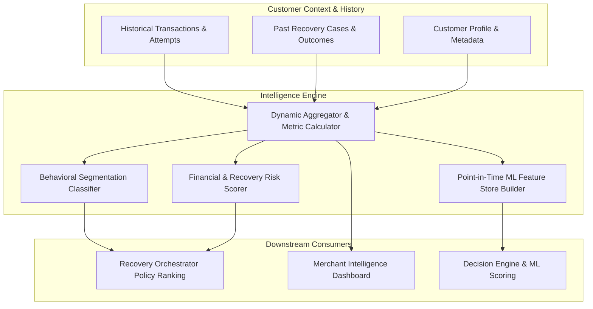

# Day 6 — Transaction & Customer Intelligence

## Overview

Day 6 delivers the **Transaction & Customer Intelligence** layer for RecoverX, equipping the AI revenue recovery engine with historical customer profiling, multi-method payment behavior analytics, customer recovery conversion tracking, and point-in-time normalized ML feature snapshots.

Rather than treating every transaction failure in isolation, RecoverX now contextualizes decisions with customer payment history: identifying preferred instruments (e.g. UPI affinity vs card loyalty), detecting decline-prone patterns, calculating retry tolerance, and dynamically boosting recovery success probabilities and reason codes.



---

## Key Deliverables

### 1. Customer Persistence Models & Intelligence Read-Model (`backend/app/models/recovery.py`)
- **Enriched `Customer` Entity:** Contact details (`name`, `email`, `phone`), risk tier (`risk_segment`), custom merchant `metadata`, and 1-to-1 `CustomerIntelligence` relationship.
- **`CustomerIntelligence` Persistence Model:**
  - Lifetime metrics: `total_transactions`, `successful_transactions`, `failed_transactions`, `recovered_transactions`, `total_spent`, `total_recovered_amount`.
  - Conversion rates: `success_rate` (0.0000–1.0000), `recovery_rate` (0.0000–1.0000).
  - Behavioral analytics: `preferred_payment_method`, `method_success_rates` (JSON), `method_usage_counts` (JSON), `recent_failure_streak`, `average_transaction_value`, `risk_score`.
  - Segmentation: `behavioral_segment` (`VIP_HIGH_VALUE`, `UPI_MOBILE_PREFERRED`, `CARD_DECLINE_PRONE_RECOVERABLE`, `HIGH_FAILURE_RISK`, `NEW_CUSTOMER`, `STANDARD_RELIABLE`).
  - Feature Store: `features` JSON containing ML feature vector array, hourly distribution, and metric dictionaries.

### 2. Customer Intelligence Service (`backend/app/services/customer_intelligence.py`)
- **`compute_customer_intelligence(session, customer_id, persist)`**: Dynamically aggregates payment attempts and transactions, analyzes failure streaks, computes method affinities, and updates intelligence snapshots.
- **`get_customer_payment_behavior(session, customer_id)`**: Deep-dive analytics per payment method (attempts, successes, failures, volume, avg amount, last used), hourly attempt heatmap, retry tolerance score, and channel affinities.
- **`get_customer_recovery_history(session, customer_id)`**: Timeline of customer recovery cases, actions taken, recovery conversion efficiency, and total recovered GMV.
- **`extract_customer_features(session, customer_id)`**: Extracts standardized, PII-free point-in-time numerical feature vectors ready for ML model scoring:
  `[tx_count, success_rate, recency_days, upi_affinity, card_affinity, avg_amount_log, failure_streak, recovery_rate, risk_score]`

### 3. Recovery Orchestrator Personalization (`backend/app/services/recovery_service.py`)
- Automatically retrieves and incorporates customer intelligence during recovery case generation.
- **Affinity Boosts:**
  - **VIP Customers (`VIP_HIGH_VALUE`):** +5% probability boost to high-friction recovery actions and adds `CUSTOMER_VIP_TIER_PRIORITY`.
  - **UPI-Affinity Shoppers (`UPI_MOBILE_PREFERRED`):** +7% probability boost to `SWITCH_TO_UPI` and adds `CUSTOMER_HISTORICAL_UPI_AFFINITY`.
  - **Card Decline Prone (`CARD_DECLINE_PRONE_RECOVERABLE`):** Penalizes `RETRY_SAME_METHOD` (-10%) to prevent endless issuer decline loops and adds `CUSTOMER_REPEATED_CARD_DECLINE_HISTORY`.
  - **New Shoppers (`NEW_CUSTOMER`):** Adds `CUSTOMER_NEW_PROFILE_BASELINE`.
- Injects customer behavioral segment, risk score, and preferred method directly into immutable `AuditLog` timeline.

### 4. Realistic Persona Simulator (`backend/app/simulator/engine.py` & API)
- Pre-packaged multi-transaction personas for live testing and demonstration:
  - **VIP Frequent Buyer (`cust_vip_priya` — Priya Sharma):** ₹60,000+ GMV, 90%+ success rate, VIP segment.
  - **UPI Mobile Shopper (`cust_upi_aarav` — Aarav Patel):** 100% UPI affinity, rapid recovery conversion on transient failures.
  - **Card Decline Prone (`cust_decline_vikram` — Vikram Malhotra):** Repeated card issuer declines, high recoverable yield via alternative payment methods.
  - **First-Time Buyer (`cust_new_ananya` — Ananya Roy):** New profile with single baseline transaction.
- Instant seeding endpoint: `POST /api/v1/simulator/seed-customers`.

---

## API Reference

### Customer Management & Intelligence Endpoints

| Method | Endpoint | Description |
| --- | --- | --- |
| `GET` | `/api/v1/customers` | List customers with search, merchant filter, risk tier filter, and summary statistics |
| `POST` | `/api/v1/customers` | Register a new customer profile |
| `GET` | `/api/v1/customers/{customer_id}` | Detailed customer profile with computed intelligence and lifetime spend |
| `PATCH` | `/api/v1/customers/{customer_id}` | Update customer preferences, contact details, or risk segment |
| `GET` | `/api/v1/customers/{customer_id}/transactions` | Paginated transaction history for customer |
| `GET` | `/api/v1/customers/{customer_id}/payment-behavior` | Method usage stats, success rates, hourly distribution, and retry tolerance |
| `GET` | `/api/v1/customers/{customer_id}/recovery-history` | Customer recovery cases timeline and recovery conversion yield |
| `GET` | `/api/v1/customers/{customer_id}/features` | Normalized ML feature snapshot vector `[tx_count, success_rate, ...]` |
| `POST` | `/api/v1/customers/{customer_id}/refresh` | Force refresh customer intelligence calculations |

---

## Quickstart & Demonstration

### 1. Seed Customer Personas

```bash
curl -X POST "http://localhost:8000/api/v1/simulator/seed-customers?merchant_id=merch_101"
```

### 2. List Customers with Intelligence

```bash
curl "http://localhost:8000/api/v1/customers?merchant_id=merch_101"
```

### 3. Inspect Customer Payment Behavior

```bash
curl "http://localhost:8000/api/v1/customers/<CUSTOMER_ID>/payment-behavior"
```

### 4. Fetch Point-in-Time ML Features

```bash
curl "http://localhost:8000/api/v1/customers/<CUSTOMER_ID>/features"
```

### 5. Inspect Recovery History

```bash
curl "http://localhost:8000/api/v1/customers/<CUSTOMER_ID>/recovery-history"
```
