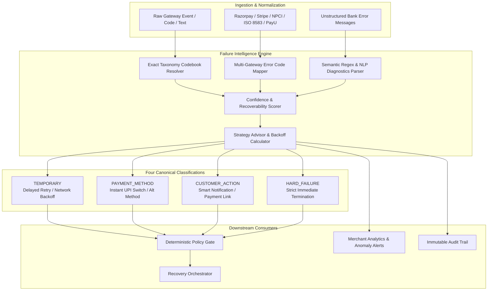

# Day 7 — Failure Intelligence & Multi-Category Classification

## Overview

Day 7 delivers the **Failure Intelligence Engine** for RecoverX, equipping the AI revenue recovery system with fine-grained error taxonomy, multi-gateway code normalization, semantic natural language failure parsing, explainable customer/merchant diagnostics, retry safety limits, and real-time failure anomaly telemetry.

Rather than treating payment declines as opaque strings or applying crude blind retries, RecoverX classifies every failure into four canonical behavioral categories:
1. **`TEMPORARY`** (Transient infrastructure & network blips)
2. **`PAYMENT_METHOD`** (Instrument-specific limits, declines & configurations)
3. **`CUSTOMER_ACTION`** (User authentication, balance, or authorization requirements)
4. **`HARD_FAILURE`** (Fatal terminal stops: blocked/stolen cards, fraud anomalies, closed accounts)



---

## The Four Canonical Failure Categories

| Category | Description | Recoverability | Strategy & Permitted Actions | Max Retries | Backoff / Delay |
| --- | --- | --- | --- | --- | --- |
| **`TEMPORARY`** | Transient network packet drops, gateway timeouts, bank CBS maintenance, rate limits, or NPCI switch degradation. | **Recoverable** | `DELAYED_RETRY`, `RETRY_SAME_METHOD`, `SWITCH_TO_UPI` | 3 | 45s – 120s (Exponential Backoff + Jitter) |
| **`PAYMENT_METHOD`** | Issuer declines (e-commerce disabled, card type unsupported, expired token, mandate failure, international tx disabled). | **Recoverable** | `SWITCH_TO_UPI`, `PAYMENT_LINK`, `SWITCH_TO_NETBANKING` | 1 | 0s (Instant alternate method switch; do NOT hammer card) |
| **`CUSTOMER_ACTION`** | User verification or balance issue (OTP timed out, 3DS dropped, insufficient funds, wrong MPIN/PIN/CVV, user cancelled). | **Recoverable** | `CUSTOMER_NOTIFICATION`, `PAYMENT_LINK` | 2 | 15s – 60s (Instant push prompt / SMS payment link) |
| **`HARD_FAILURE`** | Fatal terminal blocks (lost/stolen card, closed account, fraud/AML rejection, permanent credit limit exhausted, blacklisted VPA). | **Unrecoverable** | `STOP_RECOVERY` | 0 | 0s (Immediate strict stop; prevents chargeback/fraud liability) |

---

## Key Deliverables & Architecture

### 1. Multi-Gateway Error Translation Engine (`backend/app/services/failure_intelligence.py`)
- **Razorpay Error Mapping:**
  - `BAD_REQUEST_PAYMENT_DECLINED_BY_BANK` $\rightarrow$ `CARD_DECLINED` (`PAYMENT_METHOD`)
  - `BAD_REQUEST_PAYMENT_CARD_EXPIRED` $\rightarrow$ `EXPIRED_CARD` (`HARD_FAILURE`)
  - `BAD_REQUEST_PAYMENT_OTP_VALIDATION_FAILED` $\rightarrow$ `OTP_TIMEOUT` (`CUSTOMER_ACTION`)
  - `BAD_REQUEST_PAYMENT_INSUFFICIENT_FUNDS` $\rightarrow$ `INSUFFICIENT_FUNDS` (`CUSTOMER_ACTION`)
  - `BAD_REQUEST_PAYMENT_FRAUD_DETECTED` $\rightarrow$ `FRAUD_REJECTED` (`HARD_FAILURE`)
  - `BAD_REQUEST_PAYMENT_TIMED_OUT` $\rightarrow$ `TIMEOUT` (`TEMPORARY`)
- **Stripe Decline Code Mapping:**
  - `do_not_honor` / `card_declined` $\rightarrow$ `CARD_DECLINED` (`PAYMENT_METHOD`)
  - `lost_card` / `stolen_card` / `pickup_card` $\rightarrow$ `BLOCKED_CARD` (`HARD_FAILURE`)
  - `insufficient_funds` $\rightarrow$ `INSUFFICIENT_FUNDS` (`CUSTOMER_ACTION`)
  - `incorrect_cvc` $\rightarrow$ `INVALID_CVV` (`CUSTOMER_ACTION`)
  - `processing_error` $\rightarrow$ `GATEWAY_ERROR` (`TEMPORARY`)
  - `rate_limit` $\rightarrow$ `RATE_LIMITED` (`TEMPORARY`)
- **NPCI UPI Response Codes:**
  - `U30` / `XC` / `UT` $\rightarrow$ `TIMEOUT` (`TEMPORARY`)
  - `ZM` $\rightarrow$ `INCORRECT_PIN` (`CUSTOMER_ACTION`)
  - `ZA` $\rightarrow$ `USER_CANCELLED` (`CUSTOMER_ACTION`)
  - `ZH` / `XB` $\rightarrow$ `BANK_SERVER_DOWN` (`TEMPORARY`)
  - `U69` $\rightarrow$ `INSUFFICIENT_FUNDS` (`CUSTOMER_ACTION`)
  - `U16` $\rightarrow$ `FRAUD_REJECTED` (`HARD_FAILURE`)
  - `U28` / `U29` $\rightarrow$ `INVALID_ACCOUNT` (`HARD_FAILURE`)
  - `XY` $\rightarrow$ `BLOCKED_CARD` (`HARD_FAILURE`)
- **ISO 8583 Banking Switch Response Codes:**
  - `05` (Do Not Honor) $\rightarrow$ `CARD_DECLINED` (`PAYMENT_METHOD`)
  - `14` (Invalid Card/Account) $\rightarrow$ `INVALID_ACCOUNT` (`HARD_FAILURE`)
  - `41` / `43` (Lost/Stolen Card - Pick Up) $\rightarrow$ `BLOCKED_CARD` (`HARD_FAILURE`)
  - `51` (Insufficient Funds) $\rightarrow$ `INSUFFICIENT_FUNDS` (`CUSTOMER_ACTION`)
  - `54` (Expired Card) $\rightarrow$ `EXPIRED_CARD` (`HARD_FAILURE`)
  - `57` (Transaction Not Permitted) $\rightarrow$ `CARD_TYPE_NOT_SUPPORTED` (`PAYMENT_METHOD`)
  - `61` / `65` (Limit Exceeded) $\rightarrow$ `LIMIT_EXCEEDED_HARD` (`HARD_FAILURE`)
  - `82` (Incorrect CVV) $\rightarrow$ `INVALID_CVV` (`CUSTOMER_ACTION`)
  - `75` (PIN Tries Exceeded) $\rightarrow$ `INCORRECT_PIN` (`CUSTOMER_ACTION`)
  - `91` (Issuer Switch Inoperative) $\rightarrow$ `BANK_SERVER_DOWN` (`TEMPORARY`)
  - `96` (System Malfunction) $\rightarrow$ `GATEWAY_ERROR` (`TEMPORARY`)

### 2. Semantic NLP & Natural Language Diagnostics Parser
Extracts structured intelligence from arbitrary, unformatted error messages using high-precision regex matching and confidence scoring ($0.90 - 0.98$):
- `"Payer account has insufficient balance to complete ₹4,999 charge"` $\rightarrow$ `INSUFFICIENT_FUNDS` (`CUSTOMER_ACTION`, Confidence: 0.98)
- `"Card issuer reported online usage off for this debit card"` $\rightarrow$ `ECOMMERCE_DISABLED` (`PAYMENT_METHOD`, Confidence: 0.95)
- `"Core banking system maintenance window: bank server unavailable"` $\rightarrow$ `BANK_SERVER_DOWN` (`TEMPORARY`, Confidence: 0.95)
- `"Transaction rejected because customer card has expired"` $\rightarrow$ `EXPIRED_CARD` (`HARD_FAILURE`, Confidence: 0.98)

### 3. Customer & Merchant Explainability
Every classification produces:
- **`customer_explanation`**: Clear, empathetic, non-technical plain text suitable for checkout screens, push notifications, and SMS.
- **`merchant_explanation`**: Technical root-cause details for developer consoles and finance dashboards.
- **`compliance_notes`**: Regulatory advisories (e.g. RBI e-Commerce card controls, RBI e-Mandate 24h pre-debit rules, PCI-DSS CVV protection, Card network hotlist rules).

### 4. Failure Analytics & Anomaly Detection
- **Live Distribution Breakdown**: Total failures, counts, and percentages across each of the four categories.
- **Recovery Conversion Rate per Category**: Dynamic measurement of recovered GMV and case completion per failure type.
- **Top Failure Causes & Gateway Outage Tracking**: Aggregates failure frequencies across payment methods and gateways.
- **Automated Anomaly Detection**:
  - `TRANSIENT_SPIKE_DETECTED` (Alerts if `TEMPORARY` failures exceed 60% of total volume; triggers delayed retry policies).
  - `FRAUD_RISK_SURGE` (Alerts if `HARD_FAILURE` rates exceed 35%; triggers velocity throttling to block automated card testing attacks).

---

## API Reference

| Method | Endpoint | Description |
| --- | --- | --- |
| `POST` | `/api/v1/failures/classify` | Classify a single failure code, gateway error, or raw message |
| `POST` | `/api/v1/failures/batch-classify` | Classify multiple failure payloads in bulk |
| `GET` | `/api/v1/failures/taxonomy` | Returns full taxonomy catalog, gateway mappings, and retry limits |
| `GET` | `/api/v1/failures/analytics` | Aggregated failure distribution, recovery yields, and anomaly alerts |
| `GET` | `/api/v1/failures/{failure_code}/explain` | Detailed diagnostics, explanations, and remediation advice |

---

## Quickstart & Demonstration

### 1. Classify an Exact Failure Code
```bash
curl -X POST http://localhost:8000/api/v1/failures/classify \
  -H "Content-Type: application/json" \
  -d '{
    "failure_code": "CARD_DECLINED"
  }'
```

### 2. Classify a Gateway-Specific Error (e.g. Razorpay)
```bash
curl -X POST http://localhost:8000/api/v1/failures/classify \
  -H "Content-Type: application/json" \
  -d '{
    "gateway": "RAZORPAY",
    "gateway_code": "BAD_REQUEST_PAYMENT_DECLINED_BY_BANK"
  }'
```

### 3. Parse Natural Language Error with Semantic NLP
```bash
curl -X POST http://localhost:8000/api/v1/failures/classify \
  -H "Content-Type: application/json" \
  -d '{
    "raw_message": "Card issuer reported online usage off for this debit card"
  }'
```

### 4. Bulk Classify Multiple Failures
```bash
curl -X POST http://localhost:8000/api/v1/failures/batch-classify \
  -H "Content-Type: application/json" \
  -d '{
    "items": [
      {"failure_code": "TIMEOUT"},
      {"gateway": "STRIPE", "gateway_code": "insufficient_funds"},
      {"failure_code": "FRAUD_REJECTED"},
      {"raw_message": "online e-commerce disabled on card"}
    ]
  }'
```

### 5. Fetch Full Failure Taxonomy
```bash
curl http://localhost:8000/api/v1/failures/taxonomy
```

### 6. Inspect Live Failure Analytics & Anomaly Detection
```bash
curl http://localhost:8000/api/v1/failures/analytics
```

---

## Verification & Test Evidence

All 60 unit, integration, and API tests passing:
```bash
pytest -v
```
- Multi-category taxonomy integrity (`TEMPORARY`, `PAYMENT_METHOD`, `CUSTOMER_ACTION`, `HARD_FAILURE`)
- Exact codebook lookup and confidence scoring
- Multi-gateway error code translation (Razorpay, Stripe, NPCI, ISO 8583)
- Semantic NLP regex parsing of unstructured failure text
- Unclassified failure safe fallback to terminal stop
- Failure analytics calculation and anomaly alert thresholds
- Full API endpoint coverage (classify, batch-classify, taxonomy, explain, analytics)
