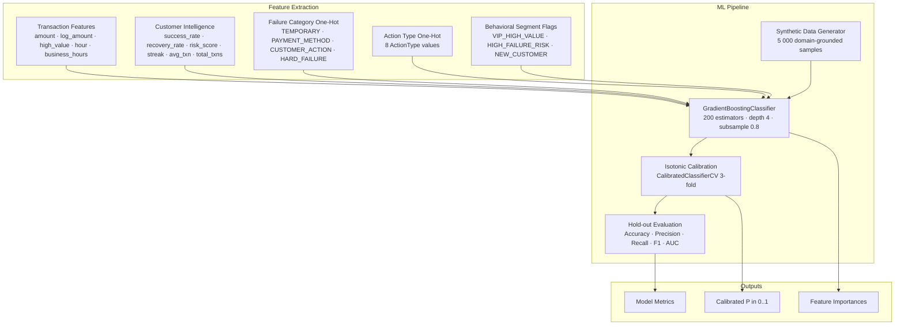

# Day 8 — Recovery Prediction Model

## Overview

Day 8 delivers the **Recovery Prediction Model** for RecoverX — a Gradient-Boosted classifier that estimates `P(success | action)` for every candidate recovery action. Rather than relying on static heuristic probabilities hardcoded in the Recovery Orchestrator, the model learns data-driven success likelihoods from domain-knowledge-derived synthetic training data and outputs **calibrated probability estimates** for downstream expected-value optimisation.



---

## Feature Engineering (26-dimensional vector)

| Group | Feature Names | Count |
|---|---|---|
| **Transaction** | `amount`, `log_amount`, `is_high_value`, `hour_of_day`, `is_business_hours` | 5 |
| **Customer Intelligence** | `customer_success_rate`, `customer_recovery_rate`, `customer_risk_score`, `customer_failure_streak`, `customer_avg_txn_value`, `customer_total_txns` | 6 |
| **Failure Category (one-hot)** | `cat_temporary`, `cat_payment_method`, `cat_customer_action`, `cat_hard_failure` | 4 |
| **Action Type (one-hot)** | `act_retry_same`, `act_switch_upi`, `act_switch_card`, `act_switch_netbanking`, `act_delayed_retry`, `act_customer_notification`, `act_payment_link`, `act_stop_recovery` | 8 |
| **Behavioral Segment (flags)** | `seg_vip`, `seg_high_risk`, `seg_new_customer` | 3 |
| **Total** | | **26** |

---

## Synthetic Training Data

A deterministic generator (`generate_synthetic_training_data`) creates realistic examples grounded in domain knowledge:
1. Randomly selects a failure category and a recovery action.
2. Samples amount (₹100–₹50 000), hour (0–23), behavioral segment, and customer-intelligence metrics.
3. Looks up a base success probability from the `_BASE_PROBS` table (category × action).
4. Applies customer-intelligence adjustments:
   - VIP segment: **+5%**; High-Failure-Risk segment: **−8%**; New Customer: **−2%**
   - High success-rate (>75%): **+4%**; failure streak >4: **−6%**; risk score >0.7: **−5%**
   - Business hours + notification/payment-link actions: **+3%**
   - High-value (>₹10 K) + retry-same-method: **−3%**
5. Adds Gaussian noise (σ = 0.08) and binarises to a label.

---

## Model Training & Calibration

| Parameter | Value |
|---|---|
| Base classifier | `GradientBoostingClassifier` |
| Estimators | 200 |
| Learning rate | 0.10 |
| Max depth | 4 |
| Min samples split | 10 |
| Min samples leaf | 5 |
| Subsample | 0.8 |
| Calibration | Isotonic regression (3-fold `CalibratedClassifierCV`) |
| Train / test split | 80 / 20 stratified |
| Training samples | 5 000 (default) |

The singleton `recovery_prediction_model` auto-trains on import — the REST API is immediately ready without a separate warm-up step.

---

## API Reference

| Method | Endpoint | Description |
|---|---|---|
| `POST` | `/api/v1/prediction/predict` | Predict success probability for a single failure × action pair |
| `POST` | `/api/v1/prediction/compare` | Compare predicted probabilities across all 8 action types |
| `GET` | `/api/v1/prediction/model/metrics` | Return training evaluation metrics (Accuracy, Precision, Recall, F1, AUC) |
| `GET` | `/api/v1/prediction/model/features` | Return ranked GBM feature importances (top-10 highlighted) |
| `POST` | `/api/v1/prediction/model/retrain` | Trigger retraining with fresh synthetic data (`n_samples`, `seed` params) |

---

## Quickstart & Demonstration

### 1. Predict Success Probability for a Single Action
```bash
curl -X POST http://localhost:8000/api/v1/prediction/predict \
  -H "Content-Type: application/json" \
  -d '{
    "failure_category": "TEMPORARY",
    "action_type": "switch_to_upi",
    "amount": 2500.0,
    "hour_of_day": 14,
    "customer_success_rate": 0.75,
    "customer_recovery_rate": 0.40,
    "customer_risk_score": 0.15,
    "customer_failure_streak": 1,
    "customer_avg_txn_value": 1800.0,
    "customer_total_txns": 32,
    "behavioral_segment": "UPI_MOBILE_PREFERRED"
  }'
```

### 2. Compare All Action Types for a Failure Scenario
```bash
curl -X POST http://localhost:8000/api/v1/prediction/compare \
  -H "Content-Type: application/json" \
  -d '{
    "failure_category": "PAYMENT_METHOD",
    "amount": 4999.0,
    "hour_of_day": 11
  }'
```

### 3. Inspect Model Metrics
```bash
curl http://localhost:8000/api/v1/prediction/model/metrics
```

### 4. View Feature Importances
```bash
curl http://localhost:8000/api/v1/prediction/model/features
```

### 5. Retrain with Larger Dataset
```bash
curl -X POST "http://localhost:8000/api/v1/prediction/model/retrain?n_samples=10000&seed=99"
```

---

## Verification & Test Evidence

All 17 unit and API tests pass:
```bash
pytest tests/test_prediction_model.py tests/test_prediction_api.py -v
```
- Feature vector dimensionality (26 features) and schema integrity
- Synthetic data generation determinism and label distribution
- Model training, calibration, and metric computation
- `predict_from_context` with and without `CustomerIntelligence`
- HARD_FAILURE + STOP_RECOVERY edge case (forced 0.0)
- Confidence label assignment (HIGH/MEDIUM/LOW thresholds)
- All 5 REST API endpoints with valid and invalid payloads
