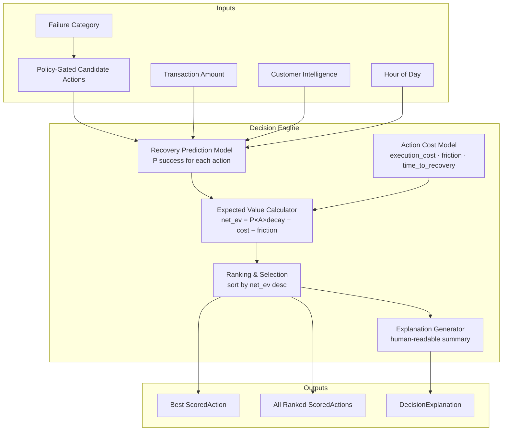

# Day 9 — Recovery Decision Engine

## Overview

Day 9 delivers the **Recovery Decision Engine** for RecoverX — an expected-value maximisation system that replaces hardcoded probability heuristics with a fully ML-driven, cost-aware action selection pipeline. The engine combines the **calibrated success probabilities** from the Day 8 prediction model with a detailed **cost model** (execution cost, customer friction, and time-to-recovery decay) to compute the **net Expected Value (EV)** of each candidate action and select the one that maximises recovered GMV.



---

## Action Cost Model

| Action Type | Execution Cost (₹) | Time to Recovery (hrs) | Friction Score | Channel |
|---|---|---|---|---|
| `RETRY_SAME_METHOD` | 0.50 | 0.1 | 0.05 | system |
| `SWITCH_TO_UPI` | 1.00 | 0.2 | 0.15 | checkout_redirect |
| `SWITCH_TO_CARD` | 1.50 | 0.3 | 0.20 | checkout_redirect |
| `SWITCH_TO_NETBANKING` | 1.50 | 0.5 | 0.25 | checkout_redirect |
| `DELAYED_RETRY` | 0.50 | 1.0 | 0.05 | system |
| `CUSTOMER_NOTIFICATION` | 2.00 | 2.0 | 0.30 | push_sms |
| `PAYMENT_LINK` | 5.00 | 12.0 | 0.50 | sms_email |
| `STOP_RECOVERY` | 0.00 | 0.0 | 0.00 | none |

Global tuning constants: `FRICTION_PENALTY_RATE = 0.02`, `TIME_DECAY_RATE = 0.01`

---

## Expected Value Formula

Given P (ML-predicted success probability) and A (transaction amount in ₹):

```
gross_ev       = P × A
friction_cost  = FRICTION_PENALTY_RATE × A × friction_score
time_decay     = exp(−TIME_DECAY_RATE × time_to_recovery_hours)
net_ev         = (gross_ev × time_decay) − execution_cost − friction_cost
```

| Term | Meaning |
|---|---|
| `gross_ev` | Raw expected recovery value before deductions |
| `friction_cost` | Customer experience penalty — 2% of amount per friction unit |
| `time_decay` | Exponential discount for delayed recovery (≈1% per hour) |
| `net_ev` | **Final score** used for ranking |

---

## Policy-Gated Candidate Actions

The engine only evaluates actions permitted by the deterministic policy gate for each failure category:

| Failure Category | Candidate Actions |
|---|---|
| `TEMPORARY` | `DELAYED_RETRY`, `RETRY_SAME_METHOD`, `SWITCH_TO_UPI` |
| `PAYMENT_METHOD` | `SWITCH_TO_UPI`, `PAYMENT_LINK`, `SWITCH_TO_NETBANKING` |
| `CUSTOMER_ACTION` | `CUSTOMER_NOTIFICATION`, `PAYMENT_LINK`, `SWITCH_TO_UPI` |
| `HARD_FAILURE` | `STOP_RECOVERY` (only — no recovery attempted) |

---

## Ranking & Explanation

1. For each candidate `ActionType`, a `RecoveryContext` is built from the request parameters.
2. The prediction model produces a calibrated `P(success)` for each action.
3. EV is computed and a `ScoredAction` record is created with a full cost breakdown.
4. Actions are sorted **descending by net EV**; ties resolved by higher probability then lower friction.
5. The top-ranked action is flagged `selected=True` with a human-readable `reason` string.
6. `explain_decision` generates a `DecisionExplanation` with a narrative summary and a full ranked comparison table ready for UI rendering.

---

## API Reference

| Method | Endpoint | Description |
|---|---|---|
| `POST` | `/api/v1/decision/evaluate` | Evaluate all candidate actions and return full ranked scores + explanation |
| `POST` | `/api/v1/decision/recommend` | Return only the single best recommended action with concise explanation |
| `GET` | `/api/v1/decision/cost-model` | Inspect the cost model configuration and global tuning constants |

---

## Quickstart & Demonstration

### 1. Evaluate All Candidate Actions (Full Breakdown)
```bash
curl -X POST http://localhost:8000/api/v1/decision/evaluate \
  -H "Content-Type: application/json" \
  -d '{
    "failure_category": "TEMPORARY",
    "amount": 3500.0,
    "hour_of_day": 15,
    "customer_success_rate": 0.72,
    "customer_recovery_rate": 0.45,
    "customer_risk_score": 0.12,
    "customer_failure_streak": 2
  }'
```

**Example response (abridged):**
```json
{
  "failure_category": "TEMPORARY",
  "amount": 3500.0,
  "best_action": {
    "action_type": "switch_to_upi",
    "probability": 0.6831,
    "expected_value": 2372.14,
    "gross_expected_value": 2390.85,
    "execution_cost": 1.0,
    "friction_penalty": 10.5,
    "time_decay_factor": 0.998,
    "rank": 1,
    "selected": true,
    "reason": "Highest expected value (₹2372.14) with 68.3% predicted success"
  },
  "explanation": {
    "summary": "Selected switch_to_upi as the optimal recovery action. ML model predicts 68.3% success probability, yielding expected value ₹2372.14 after deducting ₹1.00 execution cost and ₹10.50 friction penalty."
  }
}
```

### 2. Get a Single Best Recommendation (Lightweight)
```bash
curl -X POST http://localhost:8000/api/v1/decision/recommend \
  -H "Content-Type: application/json" \
  -d '{
    "failure_category": "PAYMENT_METHOD",
    "amount": 8000.0,
    "hour_of_day": 10
  }'
```

### 3. Inspect the Cost Model Configuration
```bash
curl http://localhost:8000/api/v1/decision/cost-model
```

---

## Verification & Test Evidence

All 14 unit and integration tests pass:
```bash
pytest tests/test_decision_engine.py -v
```
- EV formula correctness across all 8 action types
- Ranking order validation (highest-EV action selected)
- STOP_RECOVERY always returns EV = 0.0 regardless of input
- Explanation narrative generation with runner-up comparison
- Policy gate integration (only permitted actions evaluated)
- Cost model serialisation for API response
- Edge cases: single candidate, all-zero probabilities, HARD_FAILURE category
