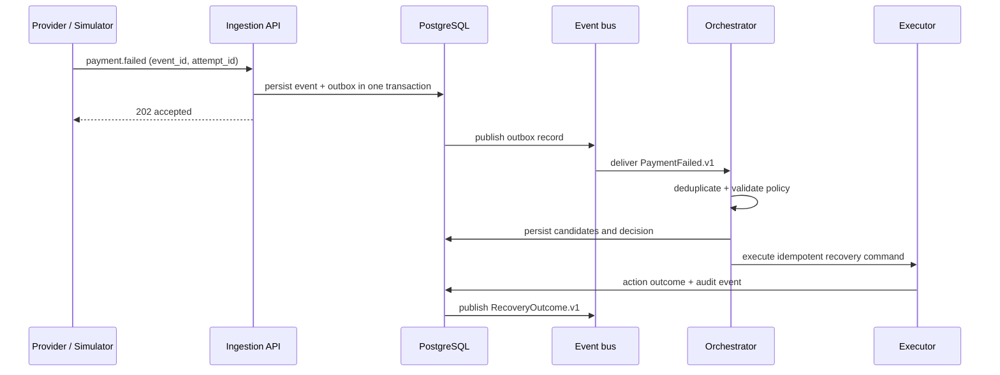

# Event Flow and Delivery Semantics

## Failed-payment recovery flow



## Event envelope

Every domain event carries a stable envelope:

```json
{
  "event_id": "uuid",
  "event_type": "payment.failed.v1",
  "occurred_at": "2026-08-23T10:15:30Z",
  "aggregate_type": "transaction",
  "aggregate_id": "txn_uuid",
  "correlation_id": "uuid",
  "causation_id": "uuid",
  "schema_version": 1,
  "payload": {}
}
```

`event_id` deduplicates delivery. `correlation_id` links the full payment journey; `causation_id` names the event that caused the new event.

## Core event catalog

| Event | Producer | Consumers | Meaning |
| --- | --- | --- | --- |
| `payment.created.v1` | Payment service | projections | Payment intent accepted |
| `payment.attempted.v1` | Payment service | audit, projections | Attempt submitted |
| `payment.failed.v1` | Payment service | orchestrator, analytics | Failed attempt facts |
| `failure.classified.v1` | Failure intelligence | decision engine, audit | Policy-relevant diagnosis |
| `recovery.decided.v1` | Decision engine | executor, dashboard | A permitted action was selected |
| `recovery.executed.v1` | Executor | audit, dashboard | Action command accepted or refused |
| `recovery.outcome.v1` | Executor | metrics, training | Success, failure, expiry, or stop |

## Delivery rules

- Producers write business state, the event row, and an outbox row in one database transaction.
- Publishers retry unsent outbox rows; consumers accept at-least-once delivery and record processed `event_id` values.
- Ordering is guaranteed only per `transaction_id`; consumers reject stale aggregate versions.
- Invalid payloads go to a quarantine table with reason, payload hash, and replay status—never silently discarded.
- Replay uses the original envelope and an explicit replay actor, preserving auditability.
