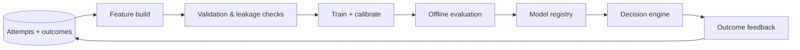

# ML Architecture

## Decision role

The model estimates `P(recovery success | context, permitted action)` for each action that survived policy. The deterministic decision engine combines it with amount, action cost, and friction penalty:

`expected_value = probability * amount - execution_cost - friction_penalty`

The model cannot make an action eligible, bypass stopping rules, or trigger execution.

## Training pipeline

## Feature contract

| Group | Examples | Restrictions |
| --- | --- | --- |
| Transaction | amount bucket, currency, merchant segment, hour | No raw PII |
| Failure | normalized code, category, gateway, attempt number | Source reason preserved separately |
| Customer history | prior method success rate, recency, attempts | Aggregate only; time-bounded snapshot |
| Action | retry delay, target payment method, notification channel | Only policy-permitted values |

Feature snapshots are keyed by `(transaction_id, event_id, feature_version)` so online decisions can be reproduced exactly.

## Evaluation and release gates

- Time-based train/validation/test splits prevent future leakage.
- Report calibration, PR-AUC, action-level precision, expected-value uplift, and performance by merchant/payment method/failure category.
- Compare every candidate model against the deterministic baseline and champion model.
- Require calibration and safety checks before registry promotion; canary a new model and retain instant rollback to the previous version.
- Log feature version, model version, score, decision, and eventual outcome for drift monitoring.

## Serving fallback

If the feature service or model is unavailable, use the versioned deterministic baseline. If required context is unavailable, choose `STOP_RECOVERY` or `NEEDS_REVIEW` according to policy—never assume missing data is favourable.
