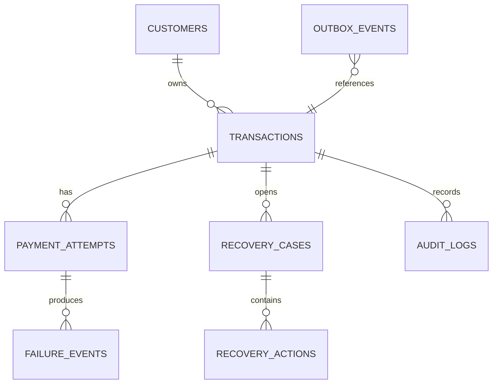

# Persistence Architecture

## Data ownership

PostgreSQL is the transactional source of truth. Redis is used only for short-lived locks, rate limits, and stream transport. The dashboard receives denormalized projections that are rebuildable from domain events and source tables.

## Operational tables

| Table | Role | Important constraints/indexes |
| --- | --- | --- |
| `transactions` | Current payment lifecycle | unique external ID; merchant/status/created index |
| `payment_attempts` | Immutable attempt facts | unique `(transaction_id, attempt_number)` |
| `failure_events` | Provider failure payload normalized | unique source event ID; category index |
| `recovery_cases` | Current recovery state machine | one open case per transaction |
| `recovery_actions` | Proposed and executed action records | unique idempotency key; case/time index |
| `audit_logs` | Append-only explanation ledger | transaction/time index; JSONB metadata |
| `outbox_events` | Transactional publication queue | unpublished/time index; unique event ID |
| `processed_events` | Consumer deduplication | unique `(consumer_name, event_id)` |
| `dashboard_daily_metrics` | Rebuildable metric projection | merchant/date unique key |

## Data lifecycle

- Keep operational and audit records for the merchant retention period; archive cold event payloads to object storage if needed.
- Store provider payloads only after field allow-listing and redaction.
- Use soft deletion or irreversible anonymization for customer deletion requests while retaining non-identifying financial aggregates where legally required.
- Partition high-volume append-only tables (`payment_attempts`, `audit_logs`, `outbox_events`) by month once volume justifies it.

## Transaction rules

1. A state change and its outbox event commit atomically.
2. Monetary values are `NUMERIC(18,2)` and currency is ISO 4217 text.
3. Every row has UTC `created_at`; mutable rows also have `updated_at` and an optimistic `version`.
4. Store decision inputs, model version, policy version, and reason codes with each selected action.
